<h1 align="center">基于Spring Boot + Vue 的教师个人成果管理系统【带论文】</h1>

- <b>完整代码获取地址：从戎源码网 ([https://armycodes.com/](https://armycodes.com/))</b>
- <b>技术探讨、资料分享，请加QQ群：692619798</b>
- <b>作者微信：19941326836  QQ：3645296857</b>
- <b>承接计算机毕业设计、Java毕业设计、Python毕业设计、深度学习、机器学习</b>
- <b>选题+开题报告+任务书+程序定制+安装调试+论文+答辩ppt 一条龙服务</b>
- <b>所有选题地址 ([https://github.com/Descartes007/allProject](https://github.com/Descartes007/allProject)) </b>

## 一、项目介绍

### 基于 Spring Boot + Vue 的教师个人成果管理系统，系统角色为：系统管理员、教师，主要功能如下
### 管理员：
- 基本操作：登录、修改密码、获取/修改个人信息、登出。
- 用户管理：用户列表/详情/新增/修改/删除、重置密码、注册审核与会话管理
- 成果与内容管理：对所有成果模块（教材、教学工作、课题、论文、专利、荣誉等）的全面 CRUD、模板下载。
- 公告管理：公告发布/修改/删除/查询（/news）。
- 文件管理：上传/下载附件、
- 审核与统计：修改审核状态
### 教师（普通用户）：
- 基本操作：登录、修改密码、获取/修改个人信息、登出。
### 本人成果管理：对自己所属的成果记录进行新增/编辑/删除/查看
- 公告与通知：查看公告列表与详情。
- 文件操作：上传附件（用于成果/个人资料）、下载模板

## 二、项目技术

- 编程语言：Java（后端）
- 项目架构：B/S 架构
- 前端技术：Vue 2 + Vue Router，Element UI，Axios，富文本（vue-quill-editor）

## 三、运行环境

- JDK版本：1.8及以上都可以
- 操作系统：Windows7/10、MacOS
- 开发工具：IDEA、Ecplise、MyEclipse都可以

## 四、数据库配置文件

- npm版本：6.14.13及以上都可以
- Redis版本：3.2.100及以上都可以
- 文件名：application.yml
- 编码类型：utf8

## 论文截图

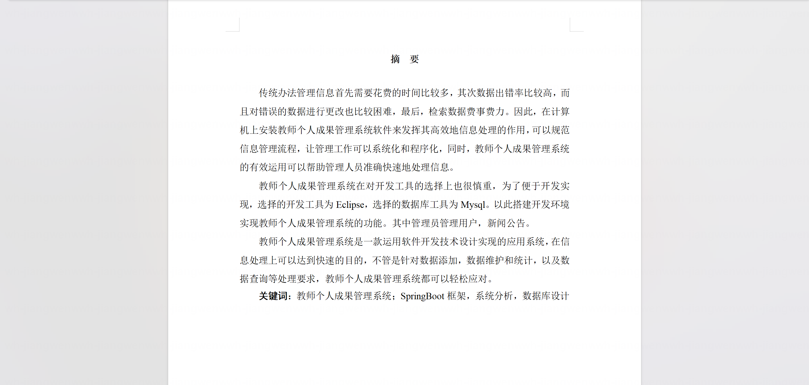

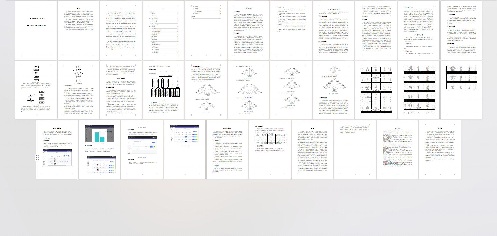

## 系统截图

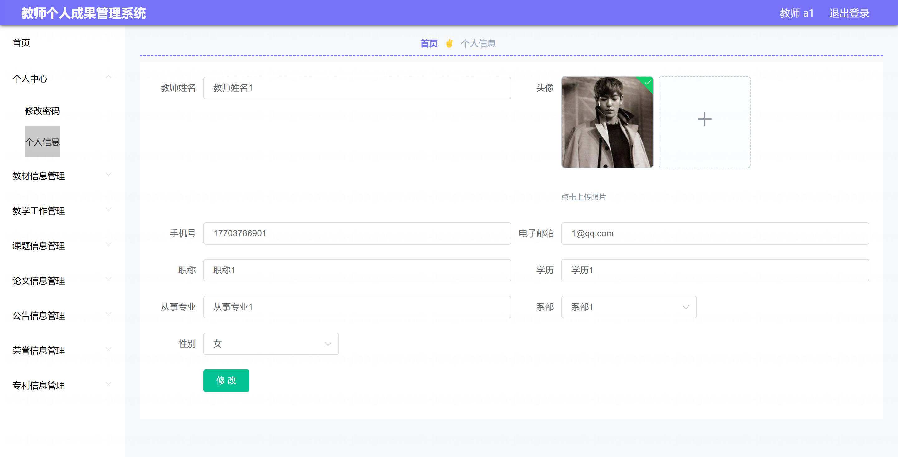

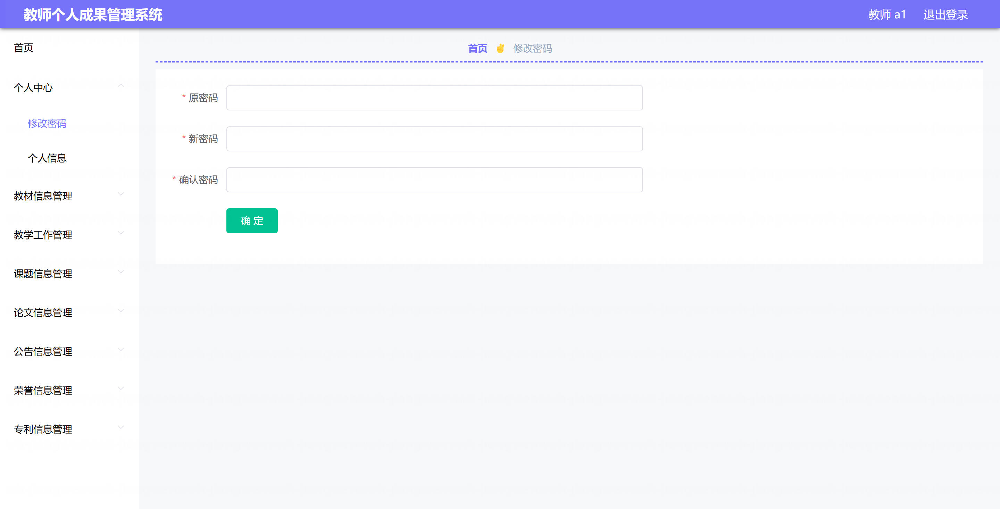

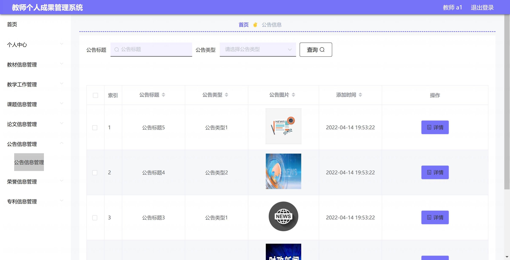

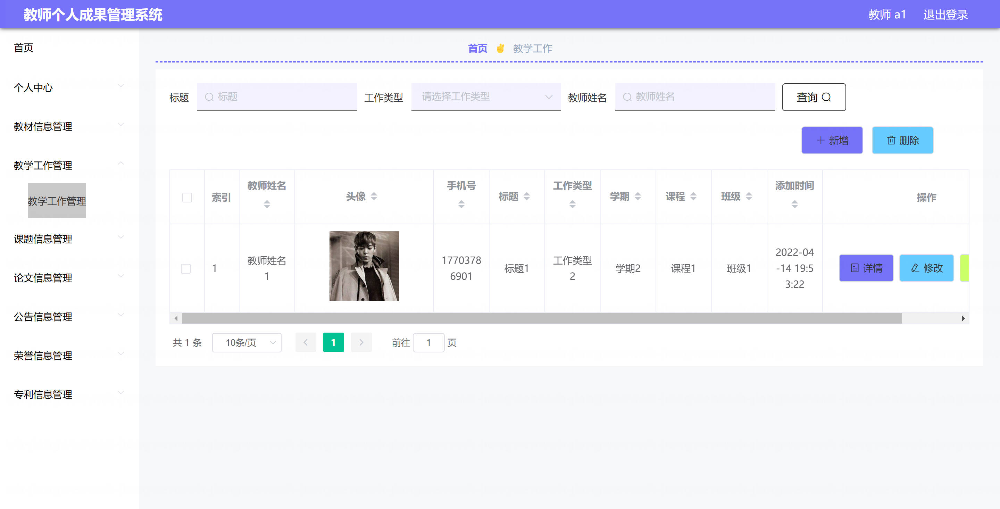

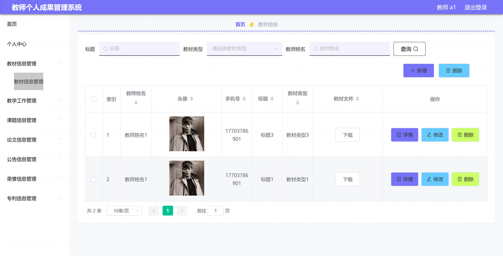

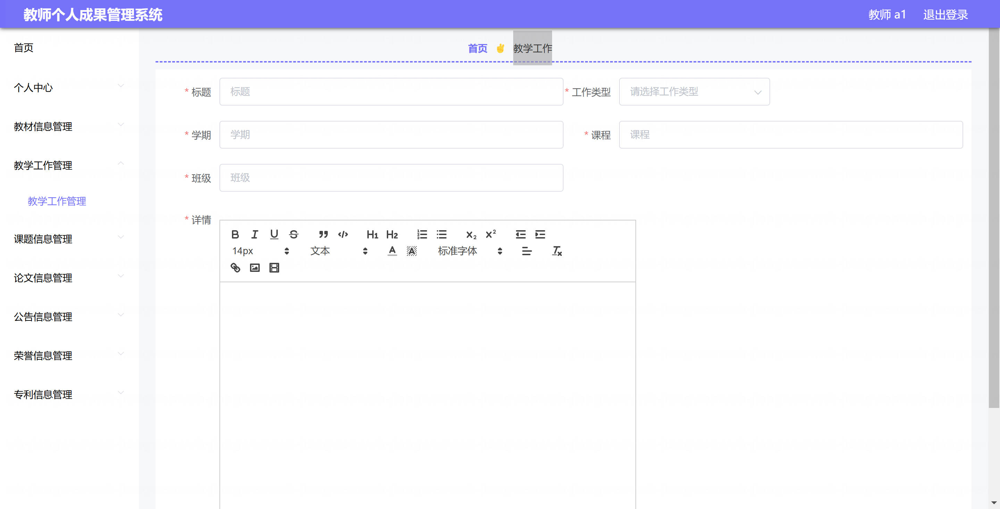

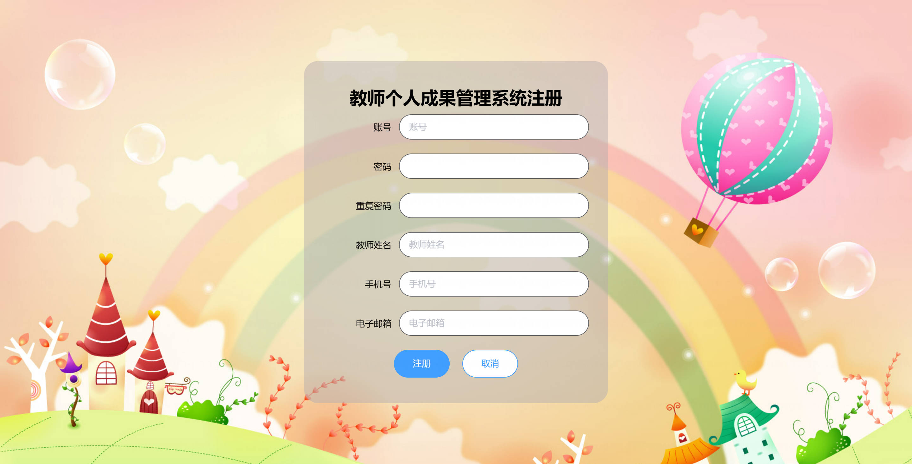

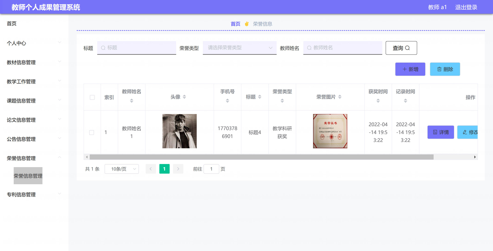

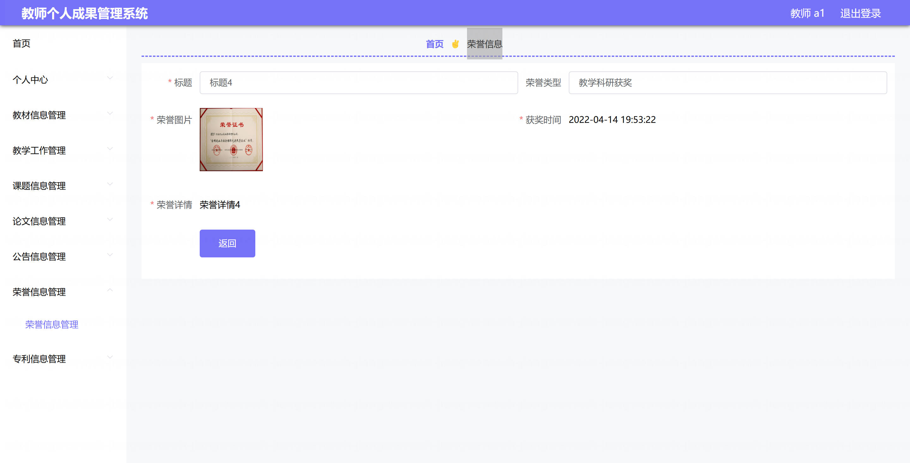

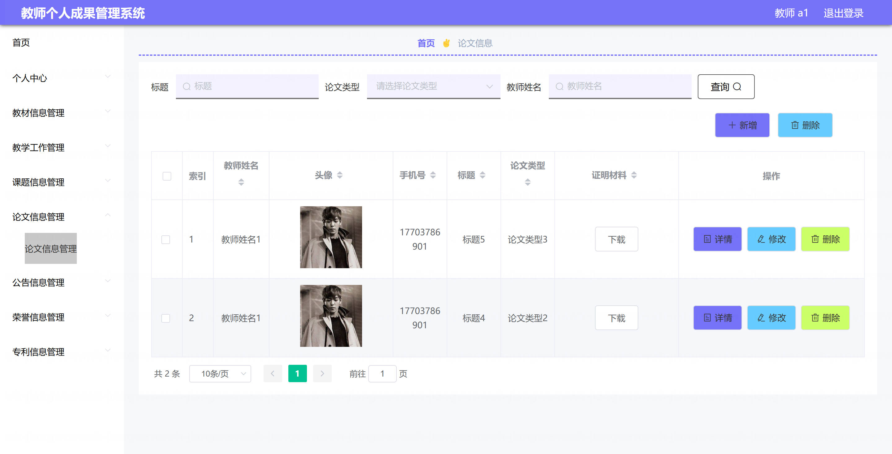